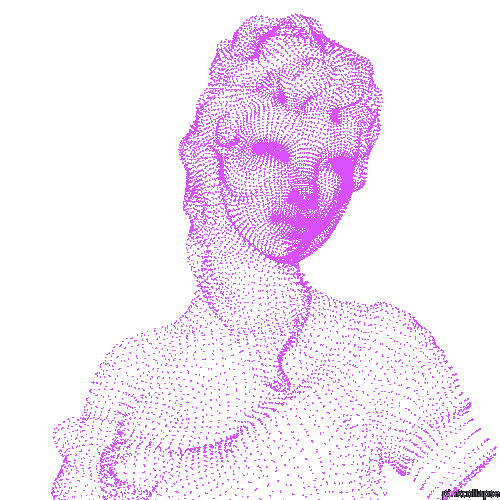

<div align="center">

# `lucasmorada@github`

### Software Engineering Student • IT Support • Full Stack Development


</div>

---

<table>
<tr>

<td width="44%" align="center">



</td>

<td width="56%">

```txt
lucasmorada@github

──────────────────────────────────────

Hi, I'm Lucas Dias

I'm a Software Engineering student and currently work in IT Support.
I enjoy building modern web applications, creating intuitive user 
experiences, and solving technical problems.

My main areas of interest include Full Stack Development, Data Science,
Cybersecurity, and software architecture.

I'm constantly learning new technologies and developing practical 
projects that strengthen both my programming and problem solving skills.

Contact:
Email:   lucasgab.siqueira@gmail.com
GitHub:  github.com/lucasmorada


```

</td>

</tr>
</table>

---

## `> technologies`

<div align="center">

### Front-end


### Back-end & Languages


### Database & Tools


</div>

---

## `> featured_projects`

<table>

<tr>

<td width="50%" valign="top">

### Plataforma de Vagas

Full stack job platform developed for managing and presenting job opportunities, with public listings, search, job details and an administrative panel.

**Stack:** HTML • CSS • JavaScript • Supabase • SQL • APIs

</td>

<td width="50%" valign="top">

### Extensão Google Sheets

Browser extension developed to automate and simplify data workflows, integrating with Google Sheets through the Google OAuth API.

**Focus:** JavaScript • Chrome Extensions • Google APIs • OAuth

</td>

</tr>

<tr>

<td width="50%" valign="top">

### Library Management System

Console based library management system developed in Java, applying object oriented programming and clean architectural principles.

**Stack:** Java 17+ • OOP • Collections API • Custom Exceptions

</td>

<td width="50%" valign="top">

### Trampei

Freelance marketplace platform designed to connect independent professionals with potential clients and organize service opportunities.

**Stack:** React • Node.js • APIs • Database

</td>

</tr>

</table>

---
## `> contact`

<div align="center">

<a href="https://www.linkedin.com/in/lucasdiassiqueira/" target="_blank">
  
</a>

<a href="https://github.com/lucasmorada" target="_blank">
  
</a>

<a href="mailto:lucasgab.siqueira@gmail.com">
  
</a>

<a href="https://www.instagram.com/diaswzj/" target="_blank">
  
</a>

<br><br>

`Crie Sem Direito de Retorno!`

</div>

